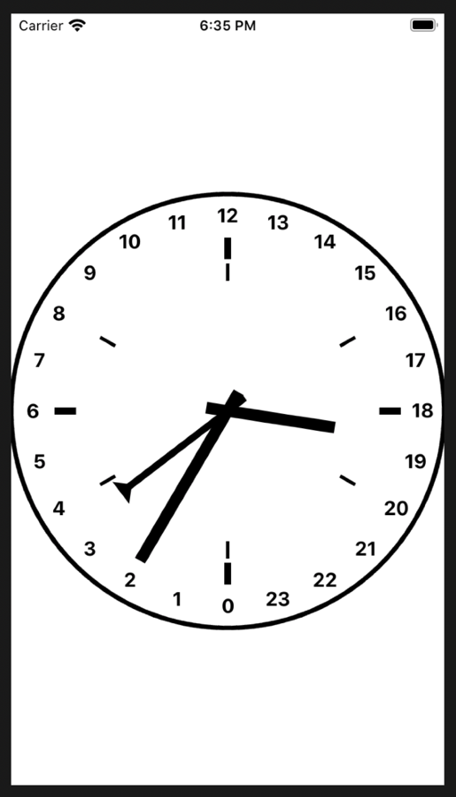

# ships_clock
This is an iOS, SwiftUI clock for tracking watches on board a ship.
It marks the day in periods of four hours.

In the following screen shot
- the short hand is an hour hand that circles the clock face once per day
- the long hand is a minute hand that circles the clock face once per hour
- the narrow hand with a triangle on the end is a "watch" hand that
  circles the clock face once every four hours
- the six light ticks deliniate four hour watches. The hour hand is within
  the current four hour watch.
- the four heavy ticks deliniate the four hours of a single watch, traced by
  the "watch" hand.

