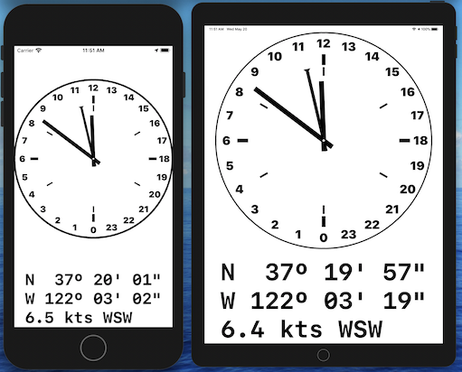

# ShipsClock
This is an iOS, SwiftUI clock for tracking watches on board a ship.
It marks the day in periods of four hours.

In the following screen shot from the app:
- the short hand is an hour hand that circles the clock face once per day
- the long hand is a minute hand that circles the clock face once per hour
- the narrow hand with a triangle on the end is a "watch" hand that
  circles the clock face once every four hours
- the four, heavy ticks at the cardinal locations delineate
  the four hours of a single watch, traced by the "watch" hand.
- the six, light ticks delineate the six, four-hour watches.
  The hour hand points within the current four-hour watch.
- the situation display below or beside the clock face (depending orientation)
  gives, if location data is available:
    - the current latitude and longitude
    - the current true heading and speed in knots

Ship's bell:
- when the clock is actively displayed, it updates the time continuously, and
  plays the ship's bell one to eight times, for each half hour of the watch.
  The bell sounds in pairs, as is customary.
- when the phone is locked or another app is actively displayed, the ship's
  bell plays using notifications, for which the app requires
  notification permission.

Here is the sound played at three bells, one and one-half hours into the watch:

[Three bells (mp3 sound file)](docs/bell_three.mp3)
